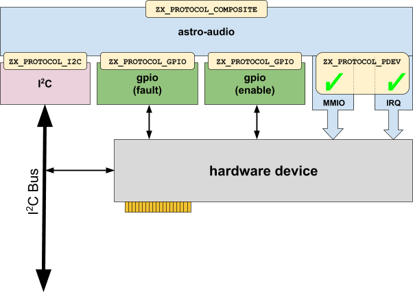
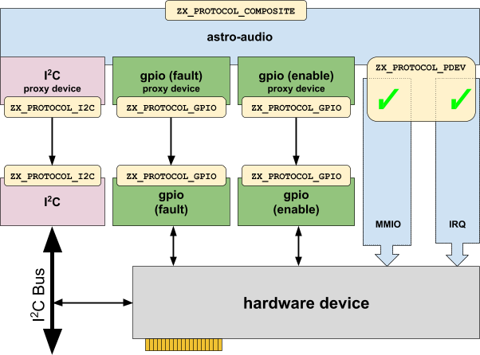

<!---

# Composite devices

--->

# 复合设备

[TOC]

<!---

## Introduction

In this section, we look at **composite devices**.
A composite device is a device composed of other devices.

These devices address the case of hardware-level composition,
in which a "device" (from the user's perspective) is implemented by several
distinct hardware blocks.

Examples include:

* a touch panel composed of an I2C device and a GPIO,
* an ethernet device composed of a MAC chip and one or more PHYs, or
* an audio device composed of an audio controller and a set of codecs.

In these situations, the relationship of the hardware is known to the board
driver at boot time (either statically or through a dynamic means, such as
ACPI).

We'll use the `astro-audio` device for our examples:

--->

## 简介

在本章内，我们将关注**复合设备**。
复合设备是指一个设备中包含其他设备。

这些设备解决了硬件级构成情况，其中“设备”（从用户的角度来看）是由几个不同的硬件块实现的。

示例中包括：

* 一个由 I2C 设备和 GPIO 组成的触摸板，
* 一个 MAC 芯片和一个或多个 PHY 组成的网络设备，或者
* 一个音频控制器和一组解码器组成的音频设备

在这种场景下，硬件关系在启动时就已被板卡驱动程序所知（不管是静态还是动态方式，例如 ACPI ）。

我们将使用`astro-audio`设备作为示例：



<!---

This device features:

* an I2C bus interface
* two sets of GPIOs (one for fault, one for enable)
* MMIO (memory mapped I/O) for bulk data transfer, and
* an IRQ (interrupt request) line to generate interrupts to the driver.

Note that the `ZX_PROTOCOL_I2C` and `ZX_PROTOCOL_GPIO` protocols are used to
transfer data; that is, I2C messages, and GPIO pin status are sent and received
through the respective drivers.

The `ZX_PROTOCOL_PDEV` part is different.
Here, the protocol is used only to grant access (the green checkmarks in the
diagram) to the MMIO and IRQ; the actual MMIO data and interrupts are **not**
handled by the `PDEV`; they're handled directly by the `astro-audio` driver
itself.

--->

这个设备的特性是：

* 一个 I2C 接口
* 两组 GPIO （一组为默认，一组为使能接口）
* 批量数据传输的 MMIO（memory mapped I/O）
* 产生驱动中断的 IRQ（Interrupt request）线

注意， `ZX_PROTOCOL_I2C` 和 `ZX_PROTOCOL_GPIO` 协议被用来传输数据；也就是说，I2C 信息和 GPIO 引脚状态是通过各自的驱动发送和接收。

`ZX_PROTOCOL_PDEV` 部分则与之不同。
这个协议仅被用于授权 MMIO 和 IRQ 的访问（图中绿色标记）； `PDEV` **不**处理真实的 MMIO 数据和中断；它们直接由`astro-audio` 驱动自己来处理。

<!---

## Creating a composite device

To create a composite device, a number of data structures need to be set up.

--->

## 创建复合设备

为了创建一个复合设备，需要设置一些数据结构。

<!---

### Binding instructions

We need a number of binding instructions (`zx_bind_inst_t`) that tell us which
devices we match.
These binding instructions are the ones discussed in the
["Registration" topic](/docs/development/drivers/developer_guide/simple.md#Registration) in the introduction section.

For the `astro-audio` device, we have:

--->

### 绑定说明

我们需要一些绑定说明（`zx_bind_inst_t`）来告诉我们匹配的设备。
这些绑定说明在介绍章节中已经在["Registration" topic](/docs/development/drivers/developer_guide/simple.md#Registration)中讨论过。

对于`astro-audio` 设备，我们有：

```c
static const zx_bind_inst_t root_match[] = {
    BI_MATCH(),
};

static const zx_bind_inst_t i2c_match[] = {
    BI_ABORT_IF(NE, BIND_PROTOCOL, ZX_PROTOCOL_I2C),
    BI_ABORT_IF(NE, BIND_I2C_BUS_ID, ASTRO_I2C_3),
    BI_MATCH_IF(EQ, BIND_I2C_ADDRESS, I2C_AUDIO_CODEC_ADDR),
};

static const zx_bind_inst_t fault_gpio_match[] = {
    BI_ABORT_IF(NE, BIND_PROTOCOL, ZX_PROTOCOL_GPIO),
    BI_MATCH_IF(EQ, BIND_GPIO_PIN, GPIO_AUDIO_SOC_FAULT_L),
};

static const zx_bind_inst_t enable_gpio_match[] = {
    BI_ABORT_IF(NE, BIND_PROTOCOL, ZX_PROTOCOL_GPIO),
    BI_MATCH_IF(EQ, BIND_GPIO_PIN, GPIO_SOC_AUDIO_EN),
};
```

<!---

These binding instructions are used to find the devices.

We have four binding instruction arrays; a `root_match[]`, which contains
common information for the other three, and then the three devices:
the I2C (`i2c_match[]`) device and the two GPIOs (`fault_gpio_match[]` and
`enable_gpio_match[]`).

These instructions are then placed into an array of structures
(`device_fragment_part_t`), which defines each fragment:

--->

这些绑定说明是用来寻找设备。

示例中我们有4个绑定说明数组；`root_match[]`包含其他3个设备的通用信息，接下来就是其他3个设备： I2C （`i2c_match[]`）设备和两个 GPIO （`fault_gpio_match[]` 和`enable_gpio_match[]`）。

接下来这些绑定说明被放入到一个结构体数组（`device_fragment_part_t`）中，它定义了各个分块：


<!---

In the `astro-audio` device, we have:

--->

在`astro-audio`设备中，我们有：

```c
static const device_fragment_part_t i2c_fragment[] = {
    { countof(root_match), root_match },
    { countof(i2c_match), i2c_match },
};

static const device_fragment_part_t fault_gpio_fragment[] = {
    { countof(root_match), root_match },
    { countof(fault_gpio_match), fault_gpio_match },
};

static const device_fragment_part_t enable_gpio_fragment[] = {
    { countof(root_match), root_match },
    { countof(enable_gpio_match), enable_gpio_match },
};
```

<!---

At this point, we have three fragment devices, `i2c_fragment[]`,
`fault_gpio_fragment[]`, and `enable_gpio_fragment[]`.

--->

这时候，我们有3个分块设备，`i2c_fragment[]`,`fault_gpio_fragment[]`, 和`enable_gpio_fragment[]`。

<!---

### Fragment device matching rules

The following rules apply:

1. The first element must describe the root of the device tree &mdash; this
   is why we've used the mnemonic `root_match` identifier.
   Note that this requirement is likely to change, since most users provide
   an "always match" anyway.
2. The last element must describe the target device itself.
3. The remaining elements must match devices on the path from the root to
   the target device, in order.
   Some of those **devices** may be skipped, but every **element** must
   be matched.
4. Every device on the path that has a property from the range
   `BIND_TOPO_START` through `BIND_TOPO_END` (basically buses, like I2C
   and PCI) must be matched.
   These sequences of matches must be unique.

Finally, we combine them into an aggregate called `fragments[]` of type
`device_fragment_t`:

--->

### 分块设备匹配规则

分块设备遵守以下规则：

1. 第一个元素必须描述设备树的根 — 这就是为什么我们用`root_match`助记符。
   注意，这个需求可能会改变，因为大多数用户都会提供一个”始终匹配”元素。
2. 最后一个元素必须描述目标设备自身。
3. 其余元素必须从根到目标设备的链路上按顺序匹配设备。一些**设备**可能被跳过，但是每一个**元素**必须匹配。
4. 路径上每一个设备都有一个属性，范围从`BIND_TOPO_START`到 `BIND_TOPO_END` （基本上是总线，例如 I2C 和 PCI ）都必须匹配。这些匹配序列必须是唯一的。

最后，我们将它们组合成一个类型为`device_fragment_t`叫做`fragments[]`的集合体中。
   


<!---

This now gives us a single identifier, `fragments[]`, that we can use
when creating the composite device.

In `astro-audio`, this looks like:

--->

现在这样给了我们一个单独的`fragments[]`标识，在创建复合设备时可以使用。

在`astro-audio`中，它看起来如下所示：

```c
static const device_fragment_t fragments[] = {
    { "i2c", countof(i2c_fragment), i2c_fragment },
    { "gpio-fault", countof(fault_gpio_fragment), fault_gpio_fragment },
    { "gpio-enable", countof(enable_gpio_fragment), enable_gpio_fragment },
};
```

<!---

### Creating the device

For simple (non-composite) devices, we used **device_add()** (which we
saw in the ["Registration" section](/docs/development/drivers/developer_guide/simple.md#Registration) previously).

For composite devices, we use **device_add_composite()**:

--->

### 创建设备

对于单（非复合）设备来说，我们使用**device_add()**（参考之前 ["Registration" section](/docs/development/drivers/developer_guide/simple.md#Registration) ）来添加设备。

对于复合设备，我们使用**device_add_composite()**接口：

```c
zx_status_t device_add_composite(
    zx_device_t* dev,
    const char* name,
    const zx_device_prop_t* props,
    size_t props_count,
    const device_fragment_t* fragments,
    size_t fragments_count,
    uint32_t coresident_device_index);
```

<!---

The arguments are as follows:

--->

其参数说明如下：

Argument                  | Meaning
--------------------------|---------------------------------------------------
`dev`                     | Parent device
`name`                    | The name of the device
`props`                   | Properties ([see "Declaring a Driver"](/docs/development/drivers/developer_guide/driver-development.md#declaring-a-driver))
`props_count`             | How many entries are in `props`
`fragments`              | The individual fragment devices
`fragments_count`        | How many entries are in `fragments`
`coresident_device_index` | Which driver host to use

<!---

The `dev` value must be the `zx_device_t` corresponding to the "`sys`"
device (i.e., the platform bus driver's device).

Note that the `coresident_device_index` is used to indicate which driver host
the new device should use.
If you specify `UINT32_MAX`, the device will reside in a new driver host.

> Note that `astro-audio` uses **pbus_composite_device_add()** rather
> than **device_add_composite()**.
> The difference is that **pbus_composite_device_add()** is an API
> provided by the platform bus driver that wraps **device_add_composite()** and
> inserts an additional fragment for ferrying over direct-access resources
> such as MMIO, IRQs, and BTIs.

--->

`dev`值必须是`zx_device_t`对应的"`sys`"设备（例如，平台总线驱动设备）。

注意，`coresident_device_index`被用来指示哪一个驱动主机是新设备要用的。
如果你指定`UINT32_MAX`，设备将驻留在一个新的驱动主机上。

> 注意`astro-audio`使用 **pbus_composite_device_add()**接口而不是**device_add_composite()**。
> 两者的区别在于**pbus_composite_device_add()**是平台总线驱动提供的 API，它封装了 **device_add_composite()**，并插入了一个用于过渡直接访问资源的额外片段，例如 MMIO ， IRQs 和 BTIs。

<!---

## Using a composite device

From a programming perspective, a composite device acts like an ordinary device,
but it has no banjo protocol. This allows you to access all of the individual
fragments that make up the composite device.

The first thing to retrieve a device for each fragment.
This is done with **device_get_fragment()**:

--->

### 使用复合设备

从编码角度来看，一个复合设备只是一个普通设备的角色，但是它没有banjo协议。这意味着你可以访问所有的组成复合设备的单独分块设备。

第一件事就是为每个分块检索出设备。
这通过**device_get_fragment()**完成：

```c
bool device_get_fragment (
     zx_device_t* parent,
     const char* fragment_name,
     zx_device_t** fragment);
```

<!---

The arguments are as follows:

--->

其参数说明如下：

Argument          | Meaning
------------------|---------------------------------------------------
`parent`          | Pointer to `zx_device_t` representing parent
`fragment_name`   | The name of the fragment you wish to fetch
`fragment`        | Pointer to `zx_device_t` representing the fragment

<!---

The program starts by declaring an array of `zx_device_t*` pointers to hold the
devices, and call **device_get_fragment()**:

--->

程序首先通过声明一个`zx_device_t*`指针数组来获取设备，然后调用**device_get_fragment()**接口：

```
zx_device_t* fragment;
bool found = device_get_fragment(&composite, "fragment-name", &fragment);
if (!found) {
    zxlogf(ERROR, "could not get fragment-name");
    return ZX_ERR_INTERNAL;
}
```
<!---
> The name of fragment supplied to **device_get_fragment()**
> is the same as the one in **device_fragment_t** entries supplied to
> the **device_add_composite()** call by the board driver.

--->

> 提供 **device_get_fragment()**的分块名和**device_fragment_t**提供给板卡驱动调用**device_add_composite()**中的名字是一样的。

<!---

## Advanced Topics

Here we discuss some specialized / advanced topics.

### Composite devices and proxies

What's actually going on in the `astro-audio` driver is a little more complex than
initially shown:

--->

## 进阶用法

接下来我们讨论一些专门的/更进阶的用法。

### 复合设备和代理

接下来将在`astro-audio` 驱动中展示的是一些比之前展示的更复杂的结构。




<!---

The fragments are bound to an internal driver (located in the
[//src/devices/internal/drivers/fragment][fragment] directory).

The driver handles proxying across process boundaries if necessary.
This proxying uses the `DEVICE_ADD_MUST_ISOLATE` mechanism (introduced
in the [Isolate devices][isolate] section).

When a device is added with `DEVICE_ADD_MUST_ISOLATE`, two devices
end up being created:
the normal device, in the same process as its parent, and a proxy.

The proxy is created in a new driver host; if the normal device's
driver is `normal.so`, then its driver is `normal.proxy.so`.
This driver is expected to implement a **create()** method, which calls
**device_add()** and stashes the IPC channel it's given.
That channel will be used later for communicating with the normal
device in order to satisfy the proxy's children's requests.

The normal device implements the `rxrpc` hook, which is invoked by
the driver runtime each time a message is received from the channel
shared with the proxy.

So, in order to implement a new protocol proxy, one must modify the
`fragment.proxy.so` drivers to handle the desired protocol by sending
messages to the normal device, and modify the `fragment.so` driver to
service those messages appropriately.

The fragment proxy is implemented in
[/src/devices/internal/drivers/fragment/fragment-proxy.cc][fragment-proxy.cc], and
the other half in
[/src/devices/internal/drivers/fragment/fragment.cc][fragment.cc].

--->

片段被绑定在一个内部驱动上（在[//src/devices/internal/drivers/fragment][fragment] 目录中）。

如果有必要，驱动会处理跨进程边界的代理。
代理使用`DEVICE_ADD_MUST_ISOLATE` 机制（详情参见 [Isolate devices][isolate] 章节）。

当一个设备使用`DEVICE_ADD_MUST_ISOLATE`机制被添加时，最终两个设备被创建：
一个为普通设备，与父进程为同一进程，另一个为代理。

在新的驱动主机中创建一个代理；如果普通设备的驱动是`normal.so`，那么代理的驱动为`normal.proxy.so`。
这个驱动需要去实现一个 **create()** 方法，它将调用**device_add()** 并存储它所给的 IPC 通道。
为了满足代理子节点请求，这个通道将被用于后续和普通设备的通信中。

普通设备实现一个`rxrpc` 回调，每次驱动运行时收到来自代理共享通道消息时调用该函数。

所以，为了实现一个新的协议代理，必须修改`fragment.proxy.so`驱动来处理发送消息到普通设备的所需协议，然后修改`fragment.so` 驱动来适配这些服务消息。

分块代理在[/src/devices/internal/drivers/fragment/fragment-proxy.cc][fragment-proxy.cc]实现，而另一半在[/src/devices/internal/drivers/fragment/fragment.cc][fragment.cc]。


<!-- xrefs -->

[fragment-proxy.cc]: /src/devices/internal/drivers/fragment/fragment-proxy.cc
[fragment.cc]: /src/devices/internal/drivers/fragment/fragment.cc
[fragment]: /src/devices/internal/drivers/fragment/
[driver.h]: /src/lib/ddk/include/ddk/driver.h
[isolate]: /docs/development/drivers/developer_guide/driver-development.md#isolate-devices

<!-- diagram source at https://docs.google.com/document/d/1JKLPaHmoISdS23TFHgDmxJgIb78TS_t4TNDnbd6PXiE/edit?usp=sharing -->

