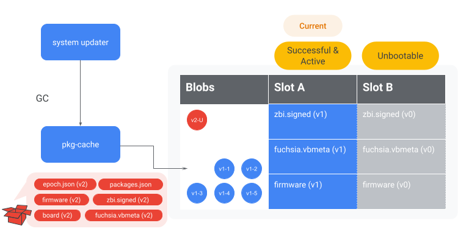
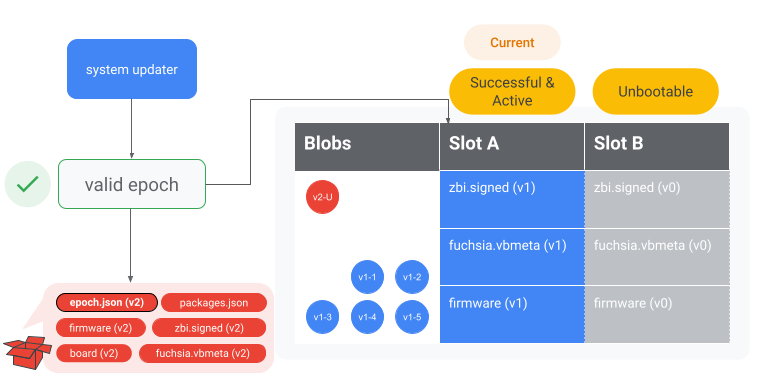
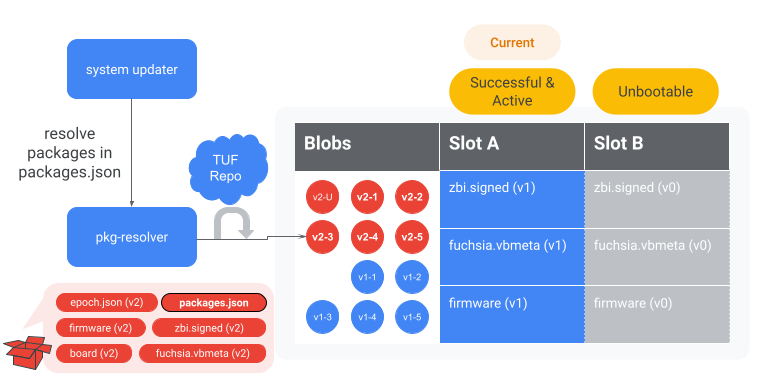
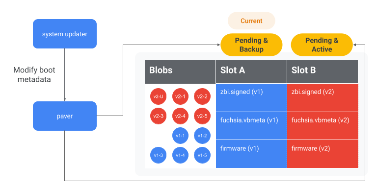

<!-- # OTA updates

Over-The-Air updates (OTAs) are a mechanism for operating system updates on
Fuchsia. This document details how OTA updates work on Fuchsia. -->

# OTA 更新

Over-The-Air （OTA）是更新Fuchsia操作系统的一种途径。本文档将描述Fuchsia是如何通过OTA进行系统更新的。

<!-- The update process is divided into the following phases:

* [Checking for an update](#checking-for-update)
* [Staging an update](#staging-update)
* [Verifying an update](#verifying-update) -->

升级过程被分为下列几个步骤：

* [检查是否需要更新](#checking-for-update)
* [进行更新](#staging-update)
* [核验更新](#verifying-update)

<!-- ## Checking for an update {#checking-for-update}

The two entry points for the operating system update process are the `omaha-client`
and the `system-update-checker` components.

Both the `omaha-client` and `system-update-checker` serve the same
purpose, to find out if there is an operating system update and start the update. -->

## 检查是否需要更新 {#checking-for-update}

系统更新的入口有两个，`omaha-client` 和  `system-update-checker`。这两个组件目的相同，都是为了检查是否有系统更新并启动更新进程。

<!-- Note: Omaha is an update availability management protocol. For more
information about Omaha, see [Omaha](https://github.com/google/omaha). -->

注意：Omaha 是一个更新可用性管理协议。若要了解更多Omaha相关，详见 [Omaha](https://github.com/google/omaha)。

<!-- Generally, products should use `omaha-client` if they want to
use Omaha to determine update availability. Products should use
`system-update-checker` if they don’t want to use Omaha and instead
want to check for updates directly from package repositories. -->

一般来说，如果设备想要使用Omaha来决定更新是否可用，此时就需要使用 `omaha-client`。

<!-- On any given Fuchsia system, only one of these components may be running:

* [Update checks with omaha-client](#update-omaha)
* [Update checks with system-update-checker](#update-system) -->

在任何Fuchsia设备上，以下两个组件只会有一个在运行：

* [使用 omaha-client 检查更新](#update-omaha)
* [使用 system-update-checker 检查更新](#update-system)

<!-- ### Update checks with omaha-client {#update-omaha}

During the boot process, `omaha-client` starts up and begins periodic update
checks. During these checks, `omaha-client` polls the Omaha server to check for
updates. -->

### 使用 omaha-client 检查更新 {#update-omaha}

在系统启动时，`omaha-client` 就开始运行并开始周期性检查更新。在检查的过程中，`omaha-client` 会轮询 Omaha 服务器来检查是否存在可用更新。

<!-- The benefits of using Omaha are:

Note: Omaha is an update availability management protocol. For more
information about Omaha, see [Omaha](https://github.com/google/omaha). -->

<!-- * It allows for a fractional rollout of system updates across a fleet of
  Fuchsia devices. For example, it can be configured that only 10% of the
  fleet of devices gets updated. This means that only 10% of these devices
  will see that there is an available update while polling Omaha. The
  remaining 90% of devices would not see an update available.
* It allows for different update channels. For example, test devices can get
  updates from the test channel and get the newest (possibly unstable)
  software. This allows production devices to get updates from the production
  channel and get the most stable software. Channel information can
  be optionally given to Omaha along with product and version.

 -->

使用 Omaha 的好处在于：

* 它可以只允许一部分Fushsia设备更新。例如，它能够被配置为只允许10%的设备能够更新。这表示只有10%的设备在Omaha轮询时能够看到有可用更新，而剩余的90%设备则无法得知存在更新。
* 它允许不同渠道的更新。例如，测试用设备能从测试渠道获取到最新（也最不稳定）的更新。同样，也可以通过生产渠道获取最稳定的版本。渠道信息可以选择性地与产品和版本一起提供给Omaha。


<!-- **Figure 1**. A simplified version of the update check process with `omaha-client`. There are
policies that gate whether `omaha-client` can check for an update or apply an update. -->

**图 1**。简化后的 `omaha-client` 的更新流程图。图中给出了 `omaha-client` 是否检查更新或是否应用更新的限制策略。

<!-- Once `omaha-client` gets the update package URL from the Omaha server, `omaha-client`
tells the `system-updater` to start an update. -->

一旦 `omaha-client` 从 Omaha 服务器获取到了更新包的 URL，`omaha-client` 将会通知 `system-updater` 启动更新进程。

<!-- ### Update checks with system-update-checker {#update-system}

Devices that don’t use `omaha-client` use the `system-update-checker`. Depending
on how it is [configured], the `system-update-checker` regularly polls for
an update package. These checks default to disabled if no `auto_update` is
specified. -->

### 使用 system-update-checker 检查更新 {#update-system}

那些不使用 `omaha-client` 的设备就需要使用 `system-update-checker` 来进行更新检查。`system-update-checker` 会按照其配置，周期性检查是否存在可用更新。如果没有指定 `auto_update`，这些检查默认为禁用状态。

<!-- To check if an update is available, the `system-update-checker` checks the
following conditions: -->

`system-update-checker` 会根据以下条件来确认是否存在可用更新：

<!-- * Is the hash of the currently running system image (located in `/pkgfs/system/meta`) different from
  the hash of system image (found in `packages.json`) in the update package?
* If the system image isn’t different, is the vbmeta that’s currently running on the system
  different from the vbmeta of the update package?
* If there is no vbmeta, is the ZBI that’s currently running on the system different from the ZBI
  of the update package? -->

* 当前运行中的系统镜像的哈希值（位于 `/pkgfs/system/meta`）是否与更新包镜像的哈希值（位于 `packages.json`）不一致？
* 如果系统镜像相同，当前系统的 vbmeta 是否与更新包 vbmeta 不一致？
* 如果不存在 vbmeta，当前系统的 ZBI 是否与更新包 ZBI 不一致？

<!-- If any of these answers are yes, then the `system-update-checker` knows the
update package has changed. Once the system-update-checker realizes the update
package has changed, the `system-update-checker` triggers the `system-updater`
to start an update using the default update package (fuchsia-pkg://fuchsia.com/update). -->

如果上述问题中有一个答案为不一致，`system-update-checker` 便会得知更新包已经被改变。一旦获知更新包改变，`system-update-checker` 会便触发 `system-updater` 来使用默认更新包（fuchsia-pkg://fuchsia.com/update）进行系统更新。


<!-- **Figure 2**. A simplified version of the update check process with the `system-update-checker`. -->

**图 2**。简化后的 `system-update-checker` 的更新流程图。

<!-- Note: There is currently no way to check bootloader-only updates because
there is no [paver API] to read the firmware. An update is not triggered
even though the update package has changed. Until this is fixed, you
should use `update force-install <update-pkg-url>` to force an update. -->

注意：目前还无法检测仅 bootloader 的更新，因为没有 [paver API] 能读取固件。在修正这项之前，即使有可用更新也不会触发更新。你需要使用 `update force-install <update-pkg-url>` 来强制更新。

<!-- If no update is required, the update checker saves the last known update
package hash. On subsequent checks for an update, the hash
of the update package that is fetched is checked against the last known
hash. If the hashes are the same, no update is triggered. If the hashes
are different, the vbmeta and ZBI are  checked for changes to determine
if an update is necessary. -->

如果不需要更新，`system-update-checker` 会保存已知的上次更新包的哈希值，在后来的更新检查中，`system-update-checker` 会首先获取更新包的哈希值并与上次保存的哈希值进行对比。如果哈希值相同，则不存在更新也不会触发更新进程。如果不一致，将会继续检查 vbmeta 和 ZBI 来确认该更新的必要性。

<!-- ## Staging an update {#staging-update} -->

<!-- Regardless if an update was triggered by `omaha-client` or `system-update-checker`,
or even a forced update check, an update needs to be written to disk. -->

## 进行更新 {#staging-update}

不论是 `omaha-client`、`system-update-checker`，还是是强制更新，最终该升级都需要被写进设备硬盘中。

<!-- The update process is divided in the following steps:

* [Initial garbage collection](#initial-garbage-collection)
* [Fetch update package](#fetch-update-package)
* [Secondary garbage collection](#secondary-garbage-collection)
* [Verify board matches](#verify-board)
* [Verify epoch is supported](#verify-epoch)
* [Fetch remaining packages](#fetch-reamaining-packages)
* [Write images to block device](#write-images-block-device)
* [Set alternate partition as active](#set-alternate-active)
* [Reboot](#reboot) -->

更新进程被分为如下几步：

* [初始化垃圾回收](#initial-garbage-collection)
* [获取更新包](#fetch-update-package)
* [第二轮垃圾回收](#secondary-garbage-collection)
* [确认主板匹配](#verify-board)
* [确认 epoch 匹配](#verify-epoch)
* [获取额外的软件包](#fetch-reamaining-packages)
* [将镜像写入块设备](#write-images-block-device)
* [将可选分区设为活动分区](#set-alternate-active)
* [重启](#reboot)

<!--  -->


 
<!-- **Figure 3**. The device is currently running hypothetical OS version 1 (on slot A) and begins to
update to hypothetical OS version 2 (to slot B). *Warning*: this may not be how the disk is
partitioned in practice. -->

**图 3**。假设目前该设备正运行在系统版本 1 上（槽 A），并即将更新到系统版本 2（槽 B）。*注意*：实际中的硬盘分区可能并非如此。

<!-- ### Initial garbage collection {#initial-garbage-collection}

Note: This does not garbage collect the old update package because the old
update package is referenced in the dynamic index. -->

### 初始化垃圾回收 {#initial-garbage-collection}

注意：此时并不会回收旧的更新包，因为旧更新包正被动态索引引用。

<!-- The `system-updater` instructs `pkg-cache` to perform garbage collection
which deletes all BLOBs that aren’t referenced in either the static or dynamic
indexes. This cleans up most of the BLOBs referenced by the old system. -->

`system-updater` 构造 `pkg-cache` 来进行垃圾回收。垃圾回收会删除不被静态以及动态索引引用的全部 BLOB。这会清理掉被旧系统使用的绝大多数 BLOB。

<!--  -->


**Figure 4**. The `system-updater` instructs `pkg-cache` to garbage collect all the blobs referenced
by slot B. Since slot B currently references version 0, all of the version 0 blobs are garbage
collected.

**图 4**。`system-updater` 构造 `pkg-cache` 来回收槽 B 引用的所有 BLOB。由于槽 B 目前引用着 版本 0 的系统，因此所有 0 号版本的 BLOB 都被回收了。

### Fetch update package {#fetch-update-package}

The `system-updater` fetches the [update package], using the provided update package URL.
The dynamic index is then updated to reference the new update package. A sample update package may
look like this:

```
/board
/epoch.json
/firmware
/fuchsia.vbmeta
/meta
/packages.json
/recovery.vbmeta
/version
/zbi.signed
/zedboot.signed
```


**Figure 5**. The `system-updater` instructs the `pkg-resolver` to resolve the version 2
update package.

Optionally, update packages may contain an `update-mode` file. This file
determines whether the system update happens in Normal or ForceRecovery
mode. If the update-mode file is not present, the `system-updater`
defaults to the Normal mode.

When the mode is ForceRecovery, the `system-updater` writes an image to recovery,
marks slots A and B as unbootable, then boots to recovery. For more information,
see the [implementation of ForceRecovery][recovery-mode-code].

### Secondary garbage collection {#secondary-garbage-collection}

After the old update package is no longer referenced by the dynamic index,
another garbage collection is triggered to delete the old update package.
This step frees up additional space for any new packages.



**Figure 6**. The `system-updater` instructs `pkg-cache` to garbage collect the version 1
update package to free up space.

### Verify board matches {#verify-board}

The current running system has a board file located in `/config/build-info/board`.
The `system-updater` verifies that the board file on the system matches the board
file in the update package.


**Figure 7**. The `system-updater` verifies the board in the update package matches the board
on slot A.

### Verify epoch is supported {#verify-epoch}

Update packages contain an epoch file (`epoch.json`). If the epoch of the update
package (the target epoch) is less than the epoch of the `system-updater`
(the source epoch), the OTA fails. For additional context,
see [RFC-0071](/docs/contribute/governance/rfcs/0071_ota_backstop.md).



**Figure 8**. The `system-updater` verifies the epoch in the update package is supported by
comparing it to the epoch of the current OS.

### Fetch remaining packages {#fetch-reamaining-packages}

The system-updater parses the `packages.json` file in the update package.
The `packages.json` looks like the following:

```json
{
  "version": “1”,
  "content": [
    "fuchsia-pkg://fuchsia.com/sshd-host/0?hash=123..abc",
    "fuchsia-pkg://fuchsia.com/system-image/0?hash=456..def"
    ...
  ]
}
```

The `system-updater` instructs the `pkg-resolver` to resolve all the package URLs.
When fetching packages, the package management system only fetches BLOBs that
are required for an update. This means that only BLOBs that don't exist or need
to be updated on the system. The package management system fetches entire BLOBs,
as opposed to a diff of whatever might currently be on the system.

Once all packages have been feteched, a BlobFS sync is triggered to flush the
BLOBs to persistent storage. This process ensures that all the necessary BLOBs
for the system update are available in BlobFS.



**Figure 9**. The `system-updater` instructs the pkg-resolver to resolve the version 2
packages referenced in `packages.json`.

### Write images to block device {#write-images-block-device}

The `system-updater` determines which images need to be written to the block
device. There are two kinds of images, assets and firmware.

Note: For more information on how this works, see the [`update.rs`][update-rs] file.
To see the difference between assests and firmware images, see the [`paver.rs`][image-types] file.

Then, the `system-updater` instructs the paver to write the bootloader and
firmware. The final location of these images does not depend on whether
the device supports [ABR](/docs/glossary.md#ABR). To prevent flash wear,
the image is only written to a partition if the image is different from the
image that already exists on the block device.

Note: To see more information on how the Fuchsia paver works for the bootloader,
see [`fuchsia.paver`][fuchsia-paver-booloader].

Then, the `system-updater` instructs the paver to write the Fuchsia ZBI and its
vbmeta. The final location of these images depends on whether the device
supports [ABR](/docs/glossary.md#ABR). If the device supports
[ABR](/docs/glossary.md#ABR), the paver writes the Fuchsia ZBI and
its vbmeta to the slot that’s not currently booted (the alternate slot).
Otherwise, the paver writes them to both the A and B partitions (if a B
partition exists).

Note: To see more information on how the Fuchsia paver works for assets,
see [`fuchsia.paver`][fuchsia-paver-assets].

Finally, the `system-updater` instructs the paver to write the recovery
ZBI and its vbmeta. Like the bootloader and firmware, the final
location does not depend on if the device supports [ABR](/docs/glossary.md#ABR).


**Figure 10**. The `system-updater` writes the version 2 images to slot B via the paver.

### Set alternate partition as active {#set-alternate-active}

If the device supports ABR, the `system-updater` uses the paver to set the
alternate partition as active. That way, the device boots into the alternate
partition on the next boot.

There are a several ways to refer to the slot state. For example, the internal
paver uses `Successful` while the [FIDL service] uses `Healthy`, while other
cases may use Active, Inactive, Bootable, Unbootable, Current, Alternate, etc...

Note: For more information on how this is implemented, see
[`data.h`][abr-slot-data].

The important metadata is 3 pieces of information that is stored for each kernel
slot. This information helps determine the state of each kernel slot. For
example, before slot B is marked as active, the metadata might look like:

|     Metadata    | Slot A | Slot B |
|:---------------:|:------:|:------:|
|     Priority    |   15   |    0   |
| Tries Remaining |    0   |    0   |
|     Healthy*    |    1   |    0   |

After slot B is marked as active, the metadata would look like:

|     Metadata    | Slot A | Slot B |
|:---------------:|:------:|:------:|
|     Priority    | **14** |**15****|
| Tries Remaining |    0   |**7**** |
|     Healthy     |    1   |    0   |

Note: These numbers are based on hardcoded values for priority and remaining
tries which are defined in [`data.h`][kAbrMaxPriority].

If the device doesn’t support ABR, this check is skipped since there is no alternate partition. Instead,
there is an active partition that is written to for every update.



**Figure 11**. The `system-updater` sets slot B to Active, so that the device boots into slot B
on the next boot.

### Reboot {#reboot}

Depending on the update configuration, the device may or may not reboot. After the device
reboots, the device boots into the new slot.


**Figure 12**. The device reboots into slot B and begins running version 2.

## Verifying an update {#verifying-update}

The system commits an update once that update is verified by the system.

The system verifies the update in the following way:

* [Rebooting into the update version](#reboot-update)
* [Committing the update](#commiting-update)

### Rebooting into the updated version {#reboot-update}

Note: In this example, it is assumed that the update is written to partition B.

On the next boot, the bootloader needs to determine which slot to boot into.
In this example, the bootloader determines to boot into slot B because
slot B has a higher priority and more than 0 tries remaining (see
[Set alternate partition as active](#set-alternate-active)). Then, the
bootloader verifies the ZBI of B matches the vbmeta of B, and finally boots into
slot B.

Note: For more information on how the bootloader determines the slot to boot
into, see [`flow.c`][flow-c].

After early boot, `fshost` launches `pkgfs` using the new system-image package.
This is the system image package that is referenced in the `packages.json`
while staging the update. The system-image package has a `static_packages` file
in it that lists the base packages for the new system. For example:

```
pkg-resolver/0 = new-version-hash-pkg-resolver
foo/0 = new-version-hash-foo
bar/0 = new-version-hash-bar
...
// Note the system-image package is not referenced in static_packages
// because it's impossible for it to refer to its own hash.
```

`pkgfs` then loads all these packages as base packages. The packages appear in
`/pkgfs/{packages, versions}`, which indicate that the packages are installed
or activated. Then, `appmgr` starts which then starts the `pkg-resolver`,
`pkg-cache`, `netstack`, etc...

### Committing the update {#commiting-update}

The `system-update-committer` component runs various checks to verify if the
new update was successful. For example, it instructs BlobFs to arbitrarily
read 1MiB of data. If the system is already committed on boot, these checks are
skipped. If the check fails and depending on how the system is configured, the
`system-update-committer` may trigger a reboot.

After the update is verified, the current partition (slot B) is marked as
`Healthy`. Using the example described in
[Set alternate partition as active](#set-alternate-active), the boot
metadata may now look like:

|     Metadata    | Slot A | Slot B |
|:---------------:|:------:|:------:|
|     Priority    |   14   |   15   |
| Tries Remaining |  **7** |  **0** |
|     Healthy     |  **0** |  **1** |

Then, the alternate partition (slot A) is marked as unbootable. Now, the
boot metadata may look like:

|     Metadata    | Slot A | Slot B |
|:---------------:|:------:|:------:|
|     Priority    |  **0** |   15   |
| Tries Remaining |  **0** |    0   |
|     Healthy     |    0   |    1   |

After this, the update is considered committed. This means:

* The system always boots into slot B until the next system update.
* The system gives up booting into slot A until the next system update
  overwrites slot A.
* The BLOBs referenced by slot A are now able to be garbage collected.
* Subsequent system updates are now allowed. When the update checker
  discovers a new update, the whole update process starts again.

[configured]: https://cs.opensource.google/fuchsia/fuchsia/+/main:src/sys/pkg/bin/system-update-checker/BUILD.gn;l=114;drc=50245a9ce68f3b877e165b004175e2a4fc12eaef
[paver API]: https://fuchsia.dev/reference/fidl/fuchsia.paver#DataSink
[update package]: /docs/concepts/packages/update_pkg.md
[recovery-mode-code]: https://cs.opensource.google/fuchsia/fuchsia/+/main:src/sys/pkg/bin/system-updater/src/update.rs;l=429;drc=202c37fa01f75c431f61ca824b4d2f7c2ec82178
[need]: https://cs.opensource.google/fuchsia/fuchsia/+/main:src/sys/pkg/bin/pkg-resolver/src/cache.rs;l=275;drc=c557680c2d1d59f4ec4f31981b08610bec7c8514
[update-rs]: https://cs.opensource.google/fuchsia/fuchsia/+/main:src/sys/pkg/bin/system-updater/src/update.rs;l=507;drc=202c37fa01f75c431f61ca824b4d2f7c2ec82178
[image-types]: https://cs.opensource.google/fuchsia/fuchsia/+/main:src/sys/pkg/bin/system-updater/src/update/paver.rs;l=200;drc=216f7ea082148714bac1e95299c1bc8b087dc1d8
[fuchsia-paver-booloader]: https://fuchsia.dev/reference/fidl/fuchsia.paver#fuchsia.paver/DynamicDataSink.WriteBootloader
[fuchsia-paver-assets]: https://fuchsia.dev/reference/fidl/fuchsia.paver#fuchsia.paver/DynamicDataSink.WriteAsset
[abr-slot-data]: https://cs.opensource.google/fuchsia/fuchsia/+/main:src/firmware/lib/abr/include/lib/abr/data.h;l=32;drc=bea16aa2d8a0bbc293a82ed44e03525ebe13bc94
[Successful]: https://cs.opensource.google/fuchsia/fuchsia/+/main:src/firmware/lib/abr/include/lib/abr/data.h;l=43;drc=bea16aa2d8a0bbc293a82ed44e03525ebe13bc94
[FIDL service]: https://fuchsia.dev/reference/fidl/fuchsia.paver#fuchsia.paver/BootManager.SetActiveConfigurationHealthy
[kAbrMaxPriority]: https://cs.opensource.google/fuchsia/fuchsia/+/main:src/firmware/lib/abr/include/lib/abr/data.h;l=28;drc=bea16aa2d8a0bbc293a82ed44e03525ebe13bc94
[flow-c]: https://cs.opensource.google/fuchsia/fuchsia/+/main:src/firmware/lib/abr/flow.c;l=197;drc=bea16aa2d8a0bbc293a82ed44e03525ebe13bc94